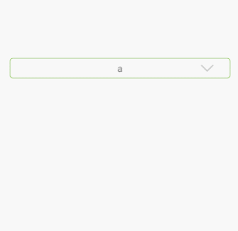

# test-down
下拉列表

1.哦，一个很尬的下拉列表，只有点击事件和主框和下拉框的背景设置，主框有两种样式箭头在最右和文字和箭头一起居中。下拉框最大高度为屏幕三分之一，超出就是带滑动的列表，没有开放设置反正代码改改合适自己用就行。是kotlin的还用了easyrecyclerview，所以本来项目没这些依赖的就别试了，上传玩的。
anko写布局是挺抽象的，和xml结合起来写比较好，kotlin我反正辣鸡，感受最大是它可以直接把方法作为参数和集合和map的创建和遍历的方便，然后还有find控件很方便。。

2.打了aar包，想想不然看看怎么上传jcenter后来我发现没找到靠谱的kotlin项目提交打包的正确姿势，嗯，然后就放弃了。

<pre>
find<test.mydownm.mydown>(R.id.t).apply {
    setData(listOf("a", "b", "c", "z"))//添加下拉列表数据，默认初始显示第一个
    setmainback(getShapeDrawable(Color.parseColor("#00000000"), dip(4).toFloat(), dip(1), Color.parseColor("#8bc44a"), null, null))//设置主框背景
    setlistback(getShapeDrawable(Color.parseColor("#00000000"), dip(4).toFloat(), dip(1), Color.parseColor("#8bc44a"), null, null))//设置下拉框背景
//  setData(listOf("a","b","c","d","e","f","g","h","i","j","k","l","m","n","o","p","q","r","s","t","u","v","w","x","y","z"))//默认最大高度为屏幕的三分之一
    setitemonclick(object : mydown.Func1 {
                //下拉框条目点击事件处理
           override fun itemclick(result: Int) {
                 Toast.makeText(this@MainActivity, result.toString(), Toast.LENGTH_SHORT).show()
           }
    })
 }
 </pre>
 <pre>
 <test.mydownm.mydown
  android:layout_centerInParent="true"
  android:id="@+id/t"
  android:layout_width="match_parent"
  android:layout_marginRight="18dp"
  app:mydownstyle="0"//0是箭头在最右，1是和文字一起居中
  android:gravity="center"
  android:layout_marginLeft="18dp"
  android:layout_height="30dp" />
  </pre>
